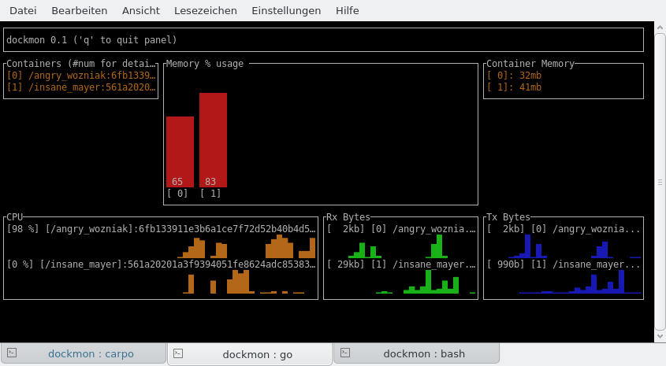

# dockmon

`dockmon` visualizes the docker runtime statistics of running docker containers.
You must have docker >=1.6 installed.

## Installation

`go get github.com/ulrichSchreiner/dockmon`

## Limitations

This is a 0.1 version; only CPU is rendered. Other data will follow.
