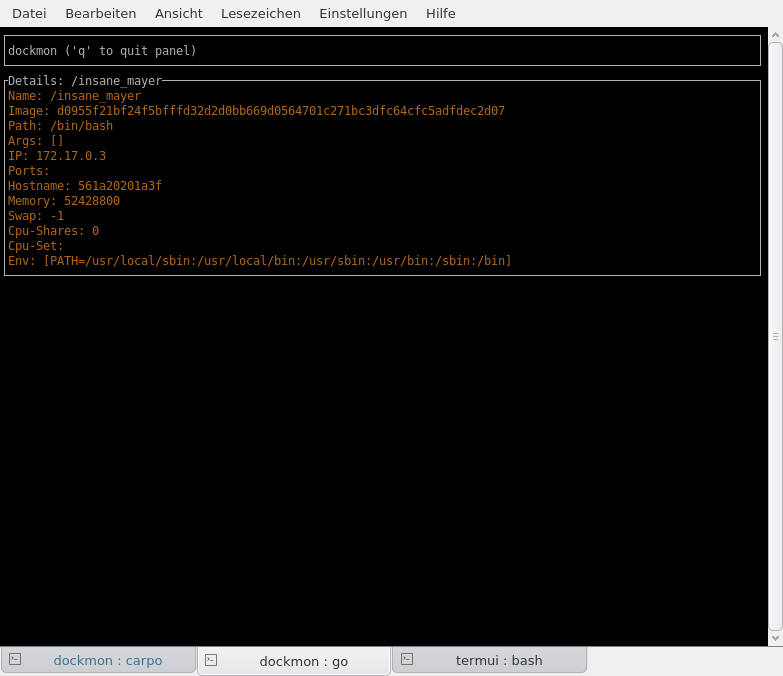

# dockmon

`dockmon` visualizes the docker runtime statistics of running docker containers.
You must have docker >=1.6 installed.

Responsive Runtime Data:

Container Details:

## Installation

[gb](http://getgb.io) is needed for building. Clone this repository and do a `gb build`.

## Limitations

This is a 0.1 version don't expect too much :-)
